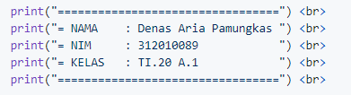

# **Tugas Ini Untuk Melengkapi Pertemuan Ke 6**

# Dan Menjelaskan Project 

 

**Nama :Denas Aria Pamungkas** <br>
**Nim :31210089** <br>
**Kelas:TI.A1.20** <br>
**Tugas:Bahasa Pemrogramman** <br>

DAFTAR ISI
| NO | Description | Link |
| ----- | ----- | ----- |
| 1 | Tugas Pertemuan 5 | [click here](#pertemuan-5---tugas)
| 2 | Tugas Pertemuan 6 - Lab 1 | [click here](#pertemuan-6---lab-1)
| 3 | Tugas Pertemuan 6 - Lab 1-2 | [click here](pertemuan-6---lab-1-2)

## Pertemuan 5 - Tugas

Pada pertemuan 5 Bahasa Pemograman saya diberi tugas oleh Dosen untuk membuat Aplikasi Biodata Python (seperti gambar dibawah ini) <br>


Saat ini saya akan menjelaskan hasil dari tugas tersebut. <br>
Berikut *source code* nya atau Klik Link berikut ([Pertemuan_5 python](pertemuan_5.py)): <br>

print("=================================") <br> 
print("= NAMA    : Denas Aria Pamungkas ") <br>
print("= NIM     : 312010089            ") <br>
print("= KELAS   : TI.20 A.1            ") <br>
print("=================================") <br>

`print("Please enter your full name : Denas Aria Pamungkas")` <br>
`fullname=input()` <br>
`print("Please enter nickname : Denas")` <br>
`nickname=input()` <br>
`print("Please enter your NPM : 312010089")` <br>
`npm=input()` <br>
`print("Please enter place of birth : Bekasi")` <br>
`pob=input()` <br>
`print("Please enter date of birth : 11 ")` <br> 
`date=input()` <br>
`print("Please enter your month of birth : October")` <br>
`month=input()` <br>
`print("Please enter year of birth : 2002") <br>
`year=int(input())` <br>
`print("Please enter your phone number : 085351106660")`
`phone=input()`
`print("Please enter your address : Kp.Baru  Rengas Bandung")`
`address=input()`

`dob=input("2020-year")` <br>

`print("\n\n Assalamu'alaikum. ")` <br>
print(f"Let me introduce my self, my name is {Denas Aria Pamungkas}, but you can call me {Denas}, my NPM {312010089}, I was born in{Bekasi} and i am {2020} years old, I am very glad if you want to invite my house in {Kp.Baru Rengas Bandung}, So don't forget to call me before with the number {085351106660}, \n\n Thank you ")

```

Berikut Penjelasannya :<br>

```python
print("please enter your full name : ") <br>
``` <br>
Source code diatas berfungsi untuk mencetak hasil / output berupa **Please enter you
 Untuk menampilkan output string, saya menggunakan tanda petik dua didalam fungsi 
menampilkan output atau hasil berupa angka atau interger saya tidak perlu menggunaka
python
print("Nama saya adalah...")
print(1234567)

(Seperti gambar dibawah ini)<br> 

 * Untuk source code berikutnya adalah inputan atau membuat variable. seperti syntax

 python

fullname=input()
 <br>
Keterangan : <br> 
>Variable adalah sebuah wadah penyimpanan data pada program yang akan akan digunakan
berfungsi sebagai variable dalam source code diatas adalah *fullname* . <br>
>Fungsi *input()* adalah untuk memasukan nilai dari layar console di command promp
saat kita menekan tombol enter (newline)<br> 
 (newline)<br>

[input](Gambar1/printnama.PNG)<br>
pada gambar di atas, hasil dari inputan tersebut berwarna hijau<br><br>
* Untuk memasukan perintah lain seperti *Nikname, NPM, Place Of Birth, Date Of Birth
Addres* mengikuti perintah sama seperti memasukan fullname<br>

* Untuk menghitung rumus saya menggunakan variable DOB yaitu 2020 (Tahun sekarang)
source code berikut :<br>
 python
dob=2020-year

<br> Pada syntax/source diatas, saya menggunakan variable (dob) dimana untuk menghit
output), yaitu dengan rumus pada variable dob=2020-year
<br>

* langkah kali ini saya akan menampilkan output yang diminta oleh dosen.<br>
output pertama yang diminta Dosen adalah menampilkan salam, yaitu dengan mengetikkan
 python
print("\n\n Assalamu'alaikum. ")

 Keterangan :
1. Fungsi *\n* pada source code di atas adalah untuk memberi baris baru / enter / 
2. Fungsi print() seperti dijelaskan pada point *Output* diatas
Hasil dari source code diatas adalah seperti gambar dibawah ini :<br>


 python

print(f"Let me introduce my self, my name is {fullname}, but you can call me {nickna
{pob} and iam {dob} years old, I am very glad if you want to invite my house in {add
before with the number {phone}, \n\n Thanks you ")
 
Keterangan : 
1. Fungsi huruf *f* pada perintah print(f"....") adalah fungsi print atau bisa m
statement dalam satu baris dibandingkan dengan metode yang lama yaitu memisahkan str
, ) atau plus ( + )<br>
2. sedangkan fungsi {} pada output tersebut adalah untuk menampilkan hasil dari vari
Hasil dari output tersebut seperti berikut :<br>


<br>
---
<br>

## Pertemuan 6 - Lab 1

Pada halaman ini (Tugas Pertemuan 6 - Lab 1) saya diberikan tugas oleh Dosen yaitu m
menggunakan bahasa Pemrograman pyhton. Berikut source code yang di berikan oleh dose
 python
#penggunaan end
print('A', end='')
print('B', end='')
print('C', end='')
print()
print('X')
print('Y')
print('z')

#penggunaan separator
w, x, y, z = 10, 15, 20, 25
print(w, x, y, z)
print(w, x, y, z, sep=',')
print(w, x, y, z, sep='')
print(w, x, y, z, sep=':')
print(w, x, y, z, sep='.....')

Oke, kali ini saya akan menjelaskan tentang materi yang di berikan oleh Dosen.<br>

*Penggunaan END
Penggunaan end digunakan untuk menambahkan karakter yang dicetak di akhir baris. sec
untuk ganti baris.  
 python
print('A', end='')
print('B', end='')
print('C', end='')

> Penggunaan print () digunakan untuk mencetak output, seperti syntax dibawah ini :

 python
print()

>Syntax dibawah ini digunakan untuk menampilkan output berupa string
 python
print('X')
print('Y')
print('z')

Hasil dari source code tersebut seperti gambar dibawah ini :<br>


* Penggunaan separator

>Pendeklarasian beberapa variable beserta nilainya
 python
w,x,y,z=10,15,20,25


>Menampilkan hasil dari variable tiap-tiap variable
 python
print(w,x,y,z)


>Menampilkan hasil dari tiap-tiap variable dengan menggunakan pemisah : (koma)
 python
print(w,x,y,z,sep=",")

>Menampilkan hasil dari tiap-tiap variable dengan menggunakan pemisah
 python
print(w,x,y,z,sep="")


>Menampilkan hasil dari tiap-tiap variable dengan menggunakan pemisah : (titik dua)
 python
print(w,x,y,z,sep=":")


>Menampilkan hasil dari tiap-tiap variable dengan menggunakan pemisah -----
 python
print(w,x,y,z,sep="-----")


hasil dari syntax / source code diatas adalah seperti berikut ini : <br>


<br>
<br>
<br>

## Pertemuan 6 - Lab 1-2

* String Format<br>
String formatting atau pemformatan string memungkinan kita menyuntikkan item kedalam
menggabungkan string menggunakan koma atau string concatenation.<br>

Penggunaan source code yang di berikan oleh dosen seperti berikut :


 python
#string format 1
print(0, 10**0)
print(1, 10**1)
print(2, 10**2)
print(3, 10**3)
print(4, 10**4)
print(5, 10**5)
print(6, 10**5)
print(8, 10**8)
print(9, 10**9)
print(10, 10**10)

#string format 1
print('{0:>3} {1:>16}'.format(0, 10**0))
print('{0:>3} {1:>16}'.format(1, 10**1))
print('{0:>3} {1:>16}'.format(2, 10**2))
print('{0:>3} {1:>16}'.format(3, 10**3))
print('{0:>3} {1:>16}'.format(4, 10**4))
print('{0:>3} {1:>16}'.format(5, 10**5))
print('{0:>3} {1:>16}'.format(6, 10**6))
print('{0:>3} {1:>16}'.format(7, 10**7))
print('{0:>3} {1:>16}'.format(8, 10**8))
print('{0:>3} {1:>16}'.format(9, 10**9))
print('{0:>3} {1:>16}'.format(10, 10**10))

<br>
Saat ini saya akan membahas satu persatu dari syntax yang telah diberikan oleh Dosen

1. *String Format 1* <br>
Pada syntax / source code strring format satu akan menampilkan output berupa 2 outpu
Yang pertama (sebelah kiri) akan menampilkan angka urut dari angka 0 hingga 10, seda
menampilkan Operasi Aritmatika Pangkat.<br> 
Dengan ketentuan sebagai berikut, Operasi pangkat dengan angka kiri sebagai pokok (R
 Hasil dari syntax tersebut adalah 10 pangkat 0, hingga 10 pangkat 10, dengan output
 
 
 2 * String Format 2* <br>
 Pada syntax atau source code string format dua akan menampilkan output berupa 2 out
yaitu kanan dan kiri )<br>
 Dengan ketentuan sebagai berikut : <br>
 >secara Default, *.format()* menggunakan rata kiri, angka ke kanan. kita dapat me
untuk mengatur perataan kiri, tengah, atau kanan. Contoh lain dalam penggunaan **.fo

  python
print('{0:8} | {1:9}'.format('Nama orang','Jumlah'))
print('{0:8} | {1:9}'.format('Doni',3.))
print('{0:8} | {1:9}'.format('Dono',10))


Hasil dari source code contoh diatas akan seperti berikut :<br>

>Secara Default,*.format()* menggunakan rata text ke kiri, angka ke kanan, kita da
> untuk mengatur perataan kiri, tengah, atau kanan. Contoh lain dalam penggunaan **.
 python
print('{:<30}{:30}{:>30}'.format('mobil','ufo','Helikopter'))
print('{:<30}{:30}{:>30}'.format(10,20,25))


Hasil dari source code contoh diatas akan muncul seperti ini :<br>

<br><br>

## pertemuan 6 - Lab 2
* Konversi Nilai Variable <br>
Untuk pembahasan terakhir, kali ini akan menyelesaikan tugas Lab 2 dari Dosen, yaitu

Tugas 

 python
a=input("masukkan nilai a : ")
b=input("masukkan nilai b : ")
print("variable a : ",a)
print("variable b : ",b)
print("hasil penggabungan {1}&{0}=%d".format(a,b) %(a+b))

#konversi nilai variable
a=int(a)
b=int(b)
print("hasil pejumlahan {1}+{0}=%d".format(a,b) %(a+b))
print("hasil pembagian {1}/{0}=%d".format(a,b) %(a/b))


<br>

### ============= THANK YOU ============= <br> 
### Denas Aria Pamungkas / 312010089 / TI.20 A.1 <br>
### ===================================== <br>
